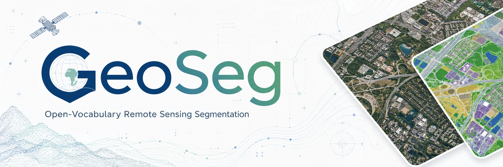
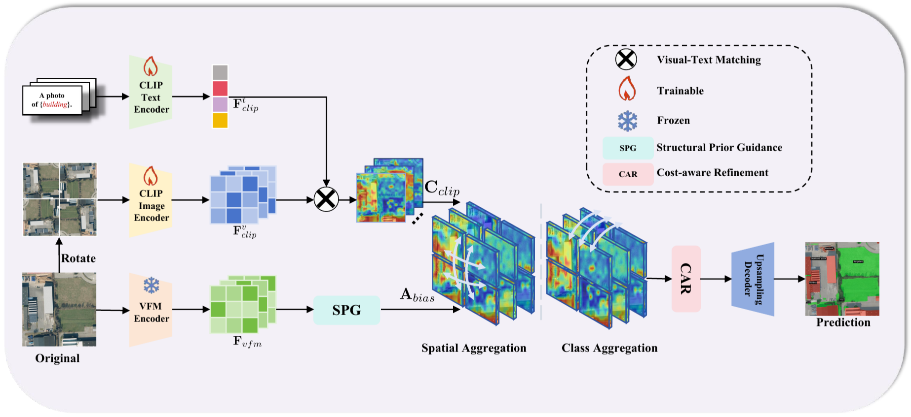
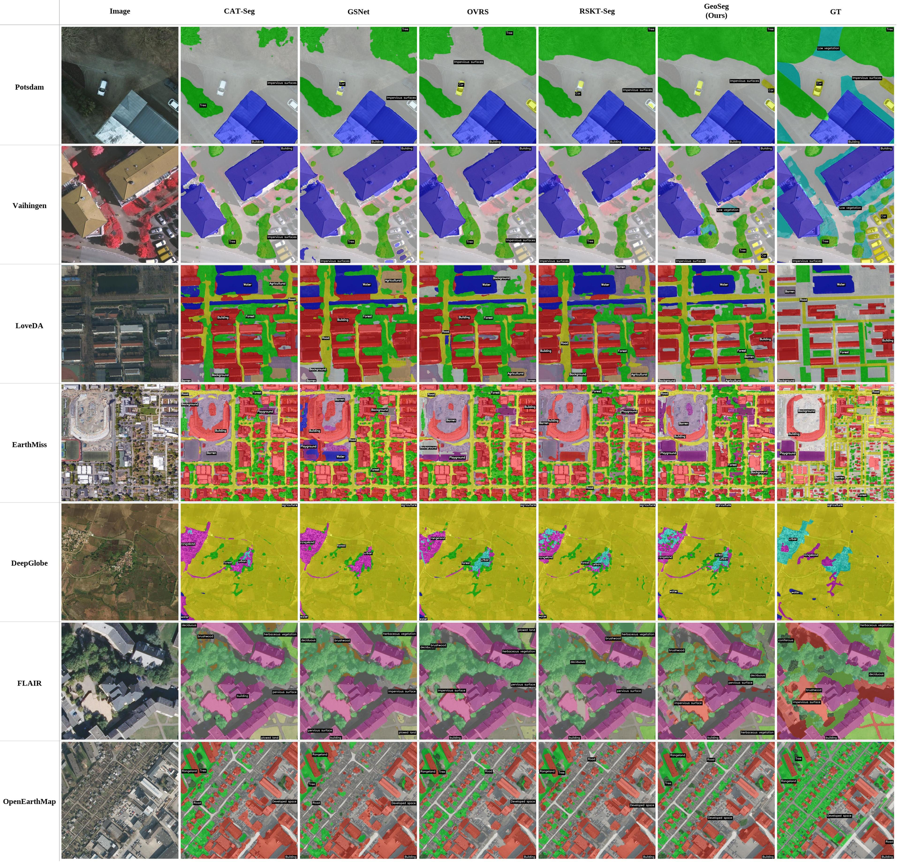
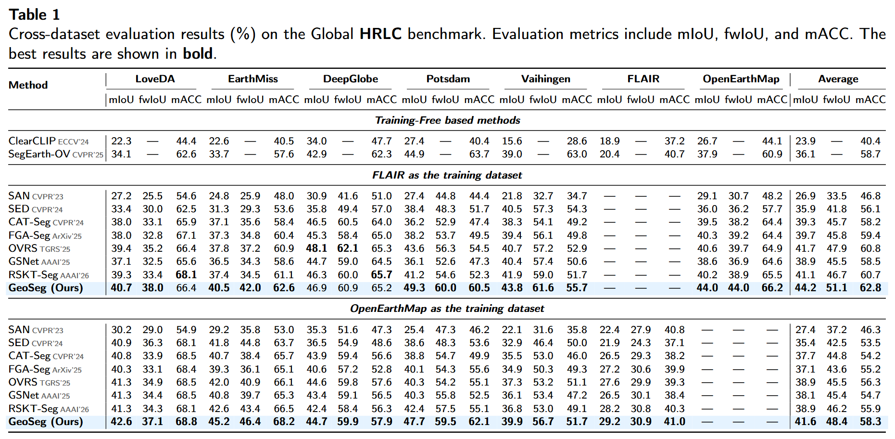

<div align="center">

<p align="center">
  
</p>

<h2 align="center">🛰️ GeoSeg: Bridging Geospatial Gaps with Structural Priors for Open-Vocabulary Remote Sensing Segmentation</h2>

Ruizhong Liu<sup>1</sup>, Tingzhang Luo<sup>2</sup>, Zaiyan Zhang<sup>3</sup>, Jundong Chen<sup>4</sup>, Hongruixuan Chen<sup>5</sup>, Shaoguang Huang<sup>1,*</sup>, Hongyan Zhang<sup>1</sup>

<sup>1</sup>China University of Geosciences &nbsp;
<sup>2</sup>City University of Hong Kong &nbsp;
<sup>3</sup>Wuhan University &nbsp;
<sup>4</sup>Shiga University &nbsp;
<sup>5</sup>RIKEN AIP &nbsp;
<sup>*</sup>Corresponding author

[](TODO_PAPER_LINK)
[](TODO_PROJECT_PAGE)
[](https://huggingface.co/datasets/rzliu1026/GHRLandCover)
[](LICENSE)

<p align="center">
  <a href="#overview">Overview</a> &nbsp;|&nbsp;
  <a href="#hrlc-benchmark">Benchmark</a> &nbsp;|&nbsp;
  <a href="#quick-start">Quick Start</a> &nbsp;|&nbsp;
  <a href="#model-zoo">Model Zoo</a> &nbsp;|&nbsp;
  <a href="#results">Results</a> &nbsp;|&nbsp;
  <a href="#citation">Citation</a>
</p>

</div>

<p align="center">
  
</p>

> **GeoSeg** is a structure-guided cost aggregation framework for open-vocabulary remote sensing semantic segmentation. Instead of using auxiliary vision foundation model features as additional visual-text matching evidence, GeoSeg keeps the CLIP matching space intact and uses frozen VFM features as structural priors to guide where cost tokens exchange information.

## 📰 News

- `[2026.06]` Repository created.

<a id="overview"></a>
## 🌍 Overview

GeoSeg addresses open-vocabulary semantic segmentation for remote sensing imagery, where models must recognize user-specified land-cover categories across heterogeneous geographic regions, sensors, and spatial resolutions. The project provides the training and evaluation code for GeoSeg, together with dataset registration files, class vocabularies, and scripts for cross-dataset evaluation on the HRLC benchmark.

GeoSeg follows the cost aggregation paradigm and introduces structural priors from frozen vision foundation models to improve cross-dataset generalization while preserving CLIP-based open-vocabulary recognition.

<p align="center">
  
</p>

<a id="hrlc-benchmark"></a>
## 🗺️ HRLC Benchmark

The HRLC benchmark is designed for cross-dataset open-vocabulary land cover segmentation. Models are trained on one source dataset and evaluated on all remaining datasets without fine-tuning.

| Dataset | Split in this repo | Role | Link |
| --- | --- | --- | --- |
| FLAIR | `FLAIR_train_sem_seg`, `FLAIR_val_sem_seg`, `FLAIR_all_sem_seg` | Train / Eval | [split](https://huggingface.co/datasets/rzliu1026/GHRLandCover/resolve/main/FLAIR_split.zip?download=true) / [all](https://huggingface.co/datasets/rzliu1026/GHRLandCover/resolve/main/FLAIR.zip?download=true) |
| OpenEarthMap | `OEM_train_sem_seg`, `OEM_val_sem_seg`, `OEM_all_sem_seg` | Train / Eval | [split](https://huggingface.co/datasets/rzliu1026/GHRLandCover/resolve/main/OEM_split.zip?download=true) / [all](https://huggingface.co/datasets/rzliu1026/GHRLandCover/resolve/main/OEM.zip?download=true) |
| LoveDA | `LoveDA_all_sem_seg` | Eval | [LoveDA.zip](https://huggingface.co/datasets/rzliu1026/GHRLandCover/resolve/main/LoveDA.zip?download=true) |
| EarthMiss | `EarthMiss_all_sem_seg` | Eval | [EarthMiss.zip](https://huggingface.co/datasets/rzliu1026/GHRLandCover/resolve/main/EarthMiss.zip?download=true) |
| DeepGlobe | `DeepGlobe_all_sem_seg` | Eval | [DeepGlobe.zip](https://huggingface.co/datasets/rzliu1026/GHRLandCover/resolve/main/DeepGlobe.zip?download=true) |
| Potsdam | `Potsdam_all_sem_seg` | Eval | [Potsdam.zip](https://huggingface.co/datasets/rzliu1026/GHRLandCover/resolve/main/Potsdam.zip?download=true) |
| Vaihingen | `Vaihingen_all_sem_seg` | Eval | [Vaihingen.zip](https://huggingface.co/datasets/rzliu1026/GHRLandCover/resolve/main/Vaihingen.zip?download=true) |

Category vocabularies are stored in [`datasets/`](datasets/). Evaluation uses the original category names from each dataset as text prompts.

<a id="quick-start"></a>
## ⚡ Quick Start

### Environment

This codebase is developed with PyTorch, Detectron2, CLIP, and Depth Anything V2.

```bash
conda create -n geoseg python=3.9.25 -y
conda activate geoseg

pip install torch==2.1.2 torchvision==0.16.2 torchaudio==2.1.2 --index-url https://download.pytorch.org/whl/cu121
pip install -r requirements.txt
```

> Note: PyTorch, TorchVision, and Detectron2 versions need to be compatible. See [pytorch.org](https://pytorch.org) for PyTorch/CUDA matching and the [Detectron2 installation docs](https://detectron2.readthedocs.io/tutorials/install.html) for supported combinations.

Reference environment used during development:

| Package | Version |
| --- | --- |
| Python | 3.9 |
| PyTorch | 2.1.2 + CUDA 12.1 |
| TorchVision | 0.16.2 |
| Detectron2 | installed from source |
| GPU | NVIDIA RTX 4090 |

### VFM Setup

This project uses [Depth Anything V2](https://github.com/DepthAnything/Depth-Anything-V2) as a VFM decoder. Our framework is flexible and can work with different VFMs, such as DINO or SAM; we chose Depth Anything V2 for its achieving better performance in our experiments. Download the pretrained weights:

- [depth_anything_v2_vitb.pth](https://huggingface.co/depth-anything/Depth-Anything-V2-Base/resolve/main/depth_anything_v2_vitb.pth)

Place them in `./pretrained/` directory, and modify the following paths in `cat_seg/cat_seg_model.py`:

```python
# Line 19: Depth Anything V2 source code path
sys.path.insert(0, '/data1/ruizhong_data/GeoSeg/Depth-Anything-V2')  # <-- modify this

# Line 80: ViT-B depth weights path
depth_path = '/data1/ruizhong_data/GeoSeg/pretrained/depth_anything_v2_vitb.pth'  # <-- modify this
```

Place Depth Anything V2 encoder checkpoints under `pretrained/`.

| Encoder | File name | Link |
| --- | --- | --- |
| Depth Anything V2 ViT-B | `depth_anything_v2_vitb.pth` | [TODO](TODO_DEPTH_VITB_WEIGHT_LINK) |

Then update the checkpoint paths in [`cat_seg/cat_seg_model.py`](cat_seg/cat_seg_model.py) if your local layout differs.

### Dataset Setup

The current dataset registration files assume one root directory containing all datasets:

```text
GHRLandCover/
+-- FLAIR_split/
|   +-- train/
|   |   +-- images/
|   |   +-- labels/
|   +-- val/
|       +-- images/
|       +-- labels/
+-- FLAIR/
|   +-- images/
|   +-- labels/
+-- OEM_split/
|   +-- train/
|   |   +-- images/
|   |   +-- labels/
|   +-- val/
|       +-- images/
|       +-- labels/
+-- OEM/
|   +-- images/
|   +-- labels/
+-- LoveDA/
|   +-- images/
|   +-- labels/
+-- EarthMiss/
|   +-- images/
|   +-- labels/
+-- DeepGlobe/
|   +-- images/
|   +-- labels/
+-- Potsdam/
|   +-- images/
|   +-- labels/
+-- Vaihingen/
    +-- images/
    +-- labels/
```

Update the `root` variable in the registration files under [`cat_seg/data/datasets/`](cat_seg/data/datasets/) to your local dataset path:

```python
root = "TODO_LOCAL_PATH_TO/GHRLandCover"
```

<a id="model-zoo"></a>
## 🏆 Model Zoo

Pretrained GeoSeg checkpoints will be provided here.

| Training set | Backbone | Auxiliary VFM | mIoU Avg. | Checkpoint | Log |
| --- | --- | --- | ---: | --- | --- |
| FLAIR | CLIP ViT-B/16 | Depth Anything V2 ViT-B | TODO | [TODO](TODO_FLAIR_VITB_CKPT) | [TODO](TODO_FLAIR_VITB_LOG) |
| OpenEarthMap | CLIP ViT-B/16 | Depth Anything V2 ViT-B | TODO | [TODO](TODO_OEM_VITB_CKPT) | [TODO](TODO_OEM_VITB_LOG) |

<a id="training"></a>
### Training

Train GeoSeg on FLAIR with CLIP ViT-B/16:

```bash
sh run_flair.sh configs/vitb_384_flair.yaml 1 output_flair
```

Train GeoSeg on OpenEarthMap with CLIP ViT-B/16:

```bash
sh run_oem.sh configs/vitb_384_oem.yaml 1 output_oem
```

The training scripts automatically launch the corresponding cross-dataset evaluation script after training finishes.

<a id="evaluation"></a>
### Evaluation

Evaluate a FLAIR-trained model:

```bash
sh eval_flair.sh configs/vitb_384_flair.yaml 1 output_flair
```

Evaluate an OpenEarthMap-trained model:

```bash
sh eval_oem.sh configs/vitb_384_oem.yaml 1 output_oem
```

For direct Detectron2-style evaluation on a single target dataset:

> Note: FLAIR dataset does not use sliding window due to its large number of images.

```bash
python train_net.py \
  --config configs/vitb_384_flair.yaml \
  --num-gpus 1 \
  --eval-only \
  OUTPUT_DIR output/eval_single \
  MODEL.WEIGHTS TODO_PATH_TO_CHECKPOINT \
  MODEL.SEM_SEG_HEAD.TEST_CLASS_JSON datasets/Potsdam.json \
  DATASETS.TEST '("Potsdam_all_sem_seg",)' \
  TEST.SLIDING_WINDOW True \
  MODEL.SEM_SEG_HEAD.POOLING_SIZES "[1,1]"
```

<a id="results"></a>
## 📈 Results

Main cross-dataset results and qualitative comparisons will be updated after release.

<p align="center">
  
</p>

<p align="center">
  
</p>

## 📁 Repository Structure

```text
GeoSeg/
+-- cat_seg/                 # GeoSeg model, CAT-Seg components, dataset registration
+-- configs/                 # ViT-B training configs
+-- datasets/                # Category vocabularies for text prompts
+-- demo/                    # Image / video visualization scripts
+-- Depth-Anything-V2/       # Auxiliary structural encoder source
+-- paper/                   # LaTeX paper source
+-- pretrained/              # Put downloaded VFM checkpoints here
+-- train_net.py             # Detectron2 training and evaluation entry
+-- run_flair.sh             # Train on FLAIR, then evaluate
+-- run_oem.sh               # Train on OpenEarthMap, then evaluate
+-- eval_flair.sh            # Cross-dataset evaluation for FLAIR-trained models
+-- eval_oem.sh              # Cross-dataset evaluation for OpenEarthMap-trained models
```

<a id="citation"></a>
## 📖 Citation

If GeoSeg is useful for your research, please consider citing our work.

```bibtex
@article{liu2026geoseg,
  title={GeoSeg: Bridging Geospatial Gaps with Structural Priors for Open-Vocabulary Remote Sensing Segmentation},
  author={Liu, Ruizhong and Luo, Tingzhang and Zhang, Zaiyan and Chen, Jundong and Chen, Hongruixuan and Huang, Shaoguang and Zhang, Hongyan},
  journal={TODO},
  year={2026}
}
```

## 🙏 Acknowledgements

This project is built upon excellent open-source work including [CAT-Seg](https://github.com/cvlab-kaist/CAT-Seg), [Detectron2](https://github.com/facebookresearch/detectron2), [CLIP](https://github.com/openai/CLIP), and [Depth Anything V2](https://github.com/DepthAnything/Depth-Anything-V2). We sincerely thank the authors and contributors for making their code and models publicly available.

## 📬 Contact

For questions about the code, data, or paper, please open an issue or contact:

- Ruizhong Liu: rzliu1026@gmail.com
- TODO additional contact
